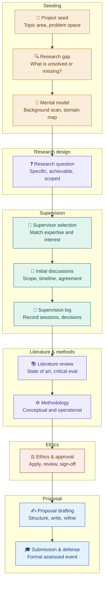

# Research Project Preparation — Process Flow

**Module:** NB6015CEM · Research Project Preparation (Level 6)

This diagram maps the end-to-end process students follow from initial topic selection through to formal proposal submission and defense. Each phase builds on the one before it — revisit earlier stages whenever your question evolves.

---

---

## Phase notes

| Phase | What you are doing | Key output |
|---|---|---|
| **Seeding** | Exploring the domain, identifying a genuine problem, forming a rough mental map | A candidate topic with a clear "so what" |
| **Research design** | Sharpening the problem into a single, testable, properly scoped question | A one-sentence research question |
| **Supervision** | Finding the right supervisor, agreeing working arrangements, keeping a formal log | Signed-off supervision agreement, ongoing log |
| **Literature & methods** | Deep literature review co-developed alongside methodology choices | Literature review draft, methodology outline |
| **Ethics** | Completing the institutional ethics approval process before drafting begins | Signed ethics approval form |
| **Proposal** | Writing, refining, and formally submitting the proposal, followed by defense | Submitted CW1, formal assessed defense |

> **Note on iteration:** the research question (Research design phase) frequently evolves during supervision and literature review. It is expected and normal to revisit earlier phases — document any pivots in your supervision log.
